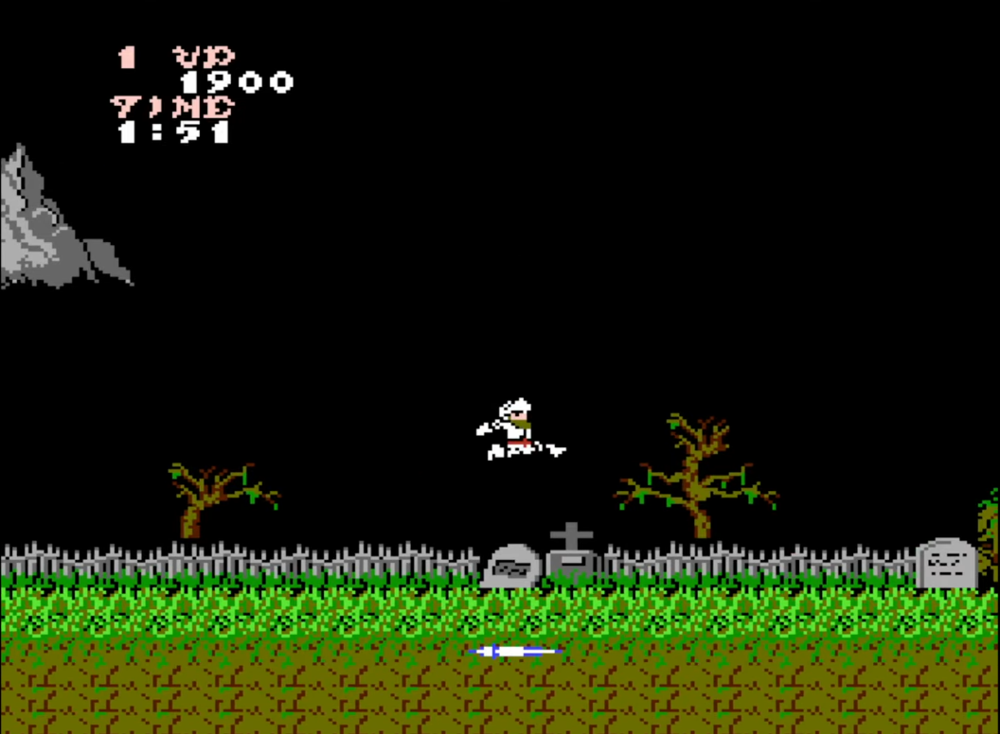

<!-- GENERAL GAME INFO -->
 

  <h2 align="center">Ghosts 'n Goblins (nes)</h2>

  

    A single-level C++ recreation of the Ghosts 'n Goblins
     
    <strong>Original game : Ghosts 'n Goblins (NES) </strong>
    <a href="https://ghostsngoblins.fandom.com/wiki/Ghosts_%27n_Goblins"><strong>General info »</strong></a>
    ·
    <a href="https://www.youtube.com/watch?v=m2iehSbgkto&t=255s"><strong>Youtube video »<strong></a>
     
     
  

<!-- TABLE OF CONTENTS -->

  
Table of Contents

  <ol>
    <li>
      <a href="#about-the-project">About The Project</a>
    </li>
    <li>
      <a href="#my-version">My version</a>
    </li>
    <li>
      <a href="#getting-started">Getting Started</a>
    </li>
    <li><a href="#how-to-play">How To Play</a></li>
    <li><a href="#class-structure">Class structure</a></li>
    <li><a href="#checklist">Checklist</a></li>
    <li><a href="#contact">Contact</a></li>
    <li><a href="#acknowledgments">Acknowledgments</a></li>
  </ol>

<!-- ABOUT THE PROJECT -->
## About The Project

Here's why:
* I personaly Liked this game
* This game met all criteria

(<a href="#readme-top">back to top</a>)

## My version

This section gives a clear and detailed overview of which parts of the original game I planned to make.

### Implemented:
* Player movement: walking, jumping, ducking, and climbing ladders
* Three throwable weapons: Lance, Knife and Torch (Torch has its own logic)
* Seven enemy types, each with its own separate logic
* Two bosses Demon and Troll which have more complex logic compared to normal enemies
* There are pickups player can pickup to get score, or new weapon 
* Level class reads data from a txt file and stores it.
* Animation class automatically manages texture timers
* A HUD class shows data as in the original game
* Sound manager can play different effects, and background music
* Entity manager manages entities and their interactions
* Debug tools: collider overlay, immortal mode, free mode, EntityManager Information dump, camera zoom

(<a href="#readme-top">back to top</a>)

<!-- GETTING STARTED -->
## Getting Started
You would need to open as a project in Visual Studio (preferably 2022);

### Prerequisites

You would need to install Visual Studio from Official Website.
* Visual Studio 2022

### How to run the project

Open the solution in Visual Studio 2022 and run the project in Debug x64 mode.

(<a href="#readme-top">back to top</a>)

<!-- HOW TO PLAY -->
## How to play

Purpouse of the game is to get to the end of the game, and beat the final boss, and get as high score as possible.

### Controls

**Start / continue**
* Enter (or numpad Enter) - start the game from the main menu, or continue to the next life from the death screen

**Movement**
* A / D or Left/Right arrow -> move left / right
* W / Up arrow / Space -> jump
* S / down arrow -> duck, or climb down a ladder

**Combat**
* E — throw your currently equipped weapon (Lance, Knife or Torch — whichever you last picked up)

**Debug (development only)**
* F1 — toggle collider visibility
* F2 — toggle immortality
* F3 — toggle flying
* F4 — print live data from entity manager
* F5 / F6 — zoom the camera in / out (default scale is 4)

(<a href="#readme-top">back to top</a>)

<!-- CLASS STRUCTURE -->
## Class structure 

### Object composition 
Dynamic-memory owners - only these three classes manage the life time of anything, and are responsible for deleting it:

TextureManager - every cached Texture*
EntityManager - every Enemy* / Projectile* / Drop* / Effect*
Game — its own Level*

Every other class either holds value memberse:
(Animation, Camera, SoundStream/SoundEffect, ect..) or a pointer into memory one of the three above (const Texture*, EntityManager*, ect..) and none of them call new or delete

Enemy (abstract)
-> Zombie 
-> Bird 
-> Flying Knight 
-> Ghost 
-> Plant 
-> Demon 
-> Troll 

All enemies share the same parrent abstract class, they overwride some of enemy base function

Projectile (abstract)
-> SimpleProjectile
-> Torch

All projectiles share the same parrent abstract class, they overwride some of enemy base function

(<a href="#readme-top">back to top</a>)

<!-- CHECKLIST -->
## Checklist

- [x] week 01 topics applied (const used throughout, structs like MovingPlatform/EnemySpawnArea carry their own behaviour, not just data)
- [x] week 02 topics applied (every class has private data + public interface)
- [x] week 03 topics applied (init lists used throughout, every class that manages memory has a destructor that frees it)
- [x] week 04 topics applied (this used to assign EntityManager to some of the enemies so they can call back into it, static keyword is applied for TextureManager/SoundManager)
- [x] week 05 topics applied (composition + association + inheritance used throughout the project)
- [x] week 06 topics applied (pure virtual functions + override used throughout the project, static_cast used for conversions when they are needed)
- [x] week 07 topics applied (friend used on EntityManager for operator<<, explicit used where needed)
- [x] week 08 topics applied (member objects vs pointers distinction applied throughout the project)
- [x] week 09 topics applied (object slicing is avoided by using polymorphism)
- [x] week 10 topics applied (Rule of 5: copy AND move constructor/assignment explicitly deleted on every class that owns raw pointers, since those objects should never be duplicated or moved)
- [x] week 11 topics applied (Level reads a custom text-based level format using ifstream + istringstream)

(<a href="#readme-top">back to top</a>)

<!-- CONTACT -->
## Contact

Mykhailo Kudenko - Mykhailo.KUDENKO@student.howest.be

Project Link: https://github.com/HowestDAE/gd14-MykhailoKudenko

(<a href="#readme-top">back to top</a>)

<!-- ACKNOWLEDGMENTS -->
## Acknowledgments

* [Sprites](https://www.spriters-resource.com/nes/ghostsngoblins/)
* [Sounds](https://www.101soundboards.com/boards/11222-ghosts-n-goblins-sounds)

(<a href="#readme-top">back to top</a>)

